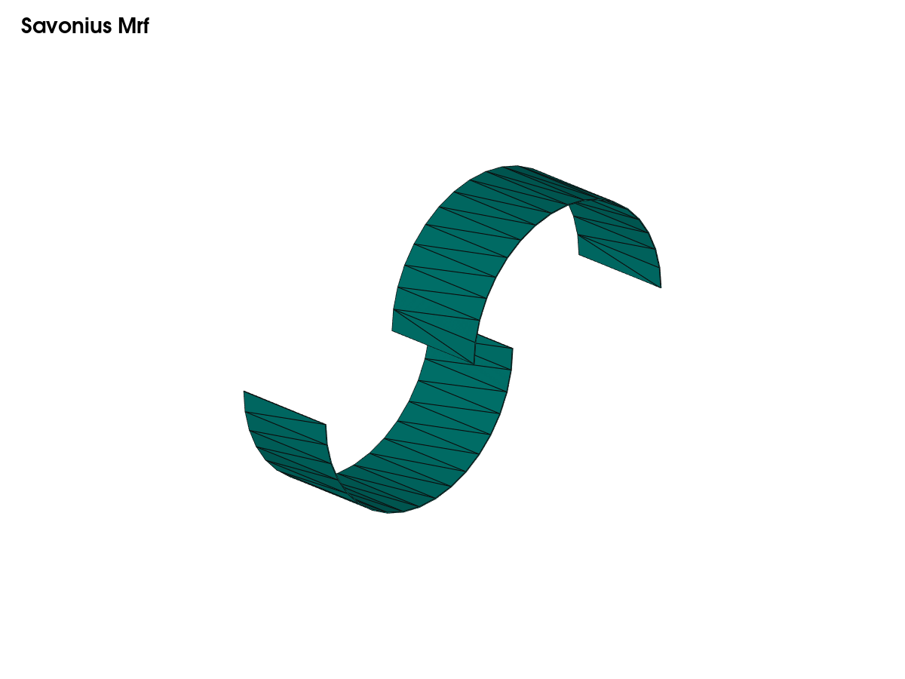
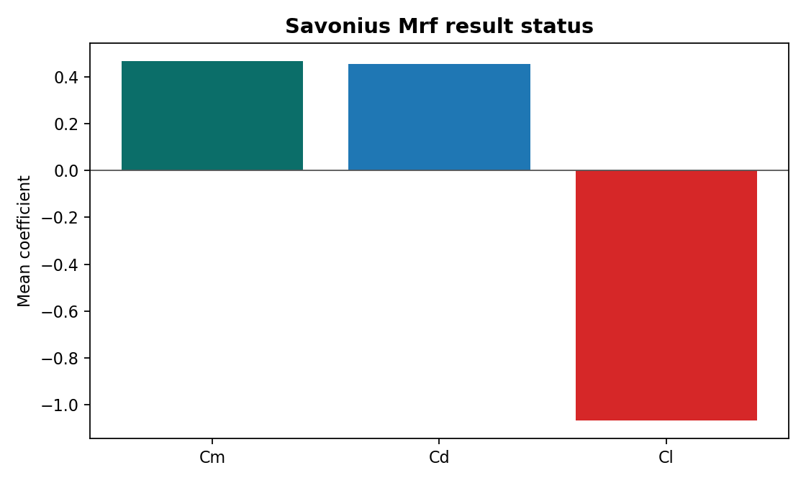

# Case Report — Savonius Mrf

## Objective

Main steady MRF reference case

## Geometry

## Method

- Solver/workflow: `simpleFoam`
- Case path: `savonius_mrf`
- Public status: `completed-summary`

## Result Summary

## Available Public Metrics

- `case`: savonius_mrf
- `angle_deg`: 0.0
- `n_rows`: 21
- `last_time`: 20.0
- `last_cm`: 0.17679602
- `last_cd`: 0.88071185
- `last_cl`: -0.41262743
- `mean_cm`: 0.46750467999999995
- `mean_cd`: 0.4532018107
- `mean_cl`: -1.0669475556

## Limitations

- This public repository keeps source dictionaries and automation scripts under version control.
- Heavy generated mesh and solver-output folders are excluded.
- If a result is marked as pending, it must be regenerated before making engineering claims.
