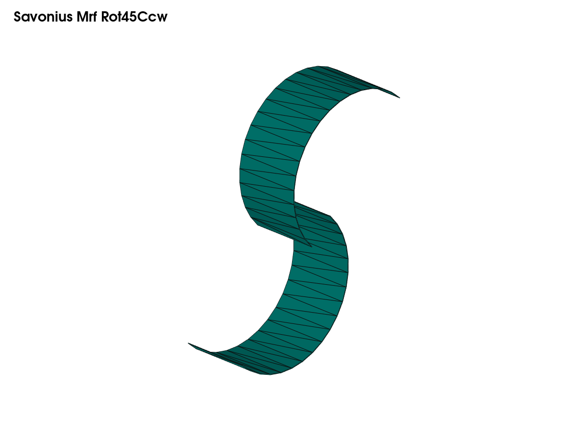
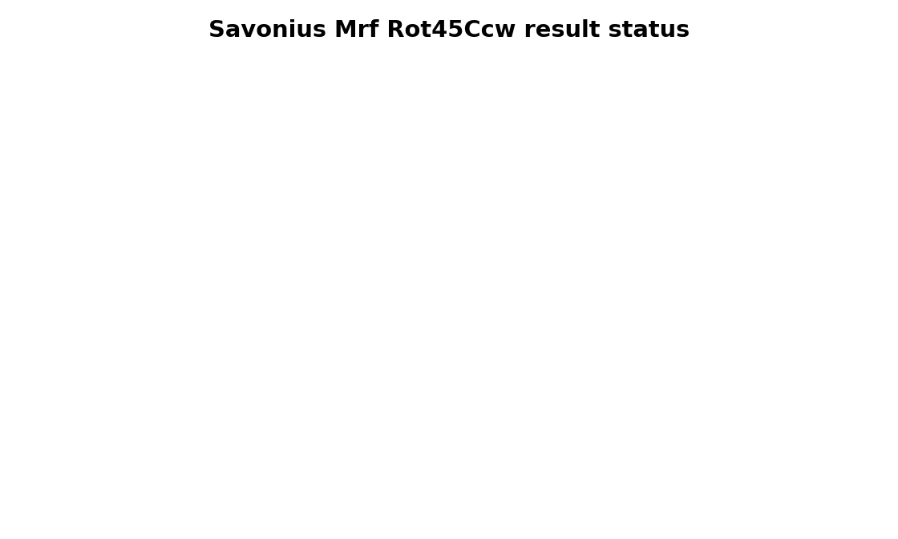

# Case Report — Savonius Mrf Rot45Ccw

## Objective

Frozen-rotor angle case, +45 deg

## Geometry

## Method

- Solver/workflow: `simpleFoam`
- Case path: `savonius_mrf_rot45ccw`
- Public status: `source-ready`

## Result Summary

## Available Public Metrics

No numerical result table is included for this case yet. The public source contains the setup and workflow needed to regenerate results.

## Limitations

- This public repository keeps source dictionaries and automation scripts under version control.
- Heavy generated mesh and solver-output folders are excluded.
- If a result is marked as pending, it must be regenerated before making engineering claims.
