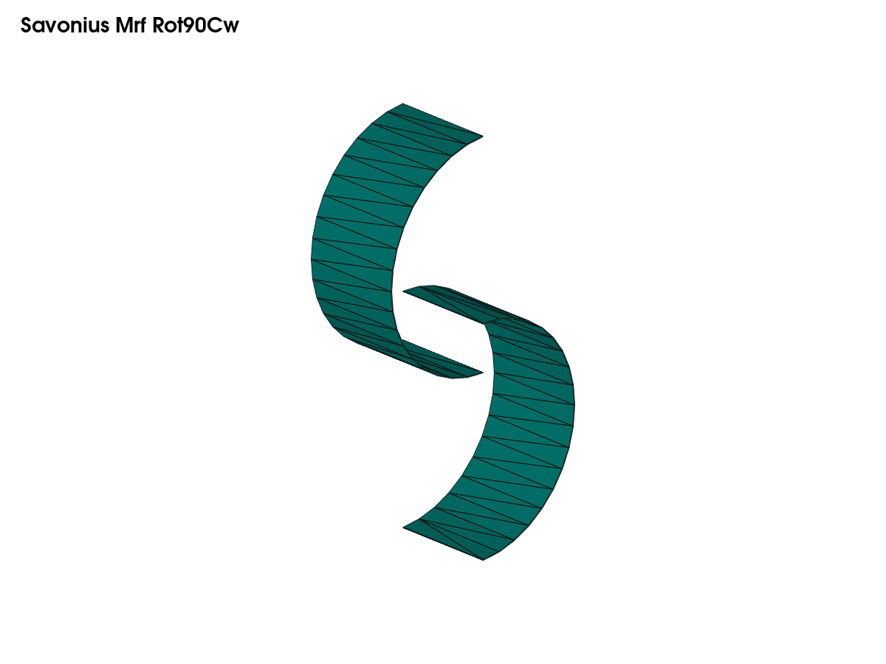
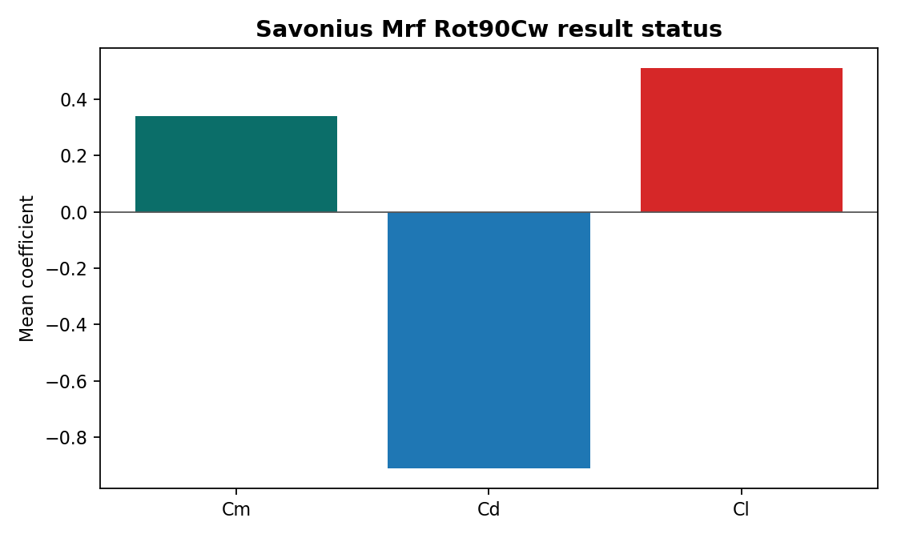

# Case Report — Savonius Mrf Rot90Cw

## Objective

Frozen-rotor angle case, -90 deg

## Geometry

## Method

- Solver/workflow: `simpleFoam`
- Case path: `savonius_mrf_rot90cw`
- Public status: `completed-summary`

## Result Summary

## Available Public Metrics

- `case`: savonius_mrf_rot90cw
- `angle_deg`: -90.0
- `n_rows`: 21
- `last_time`: 20.0
- `last_cm`: -0.096107905
- `last_cd`: 3.2373968
- `last_cl`: 0.82495612
- `mean_cm`: 0.3391702795
- `mean_cd`: -0.910919042
- `mean_cl`: 0.511811316

## Limitations

- This public repository keeps source dictionaries and automation scripts under version control.
- Heavy generated mesh and solver-output folders are excluded.
- If a result is marked as pending, it must be regenerated before making engineering claims.
