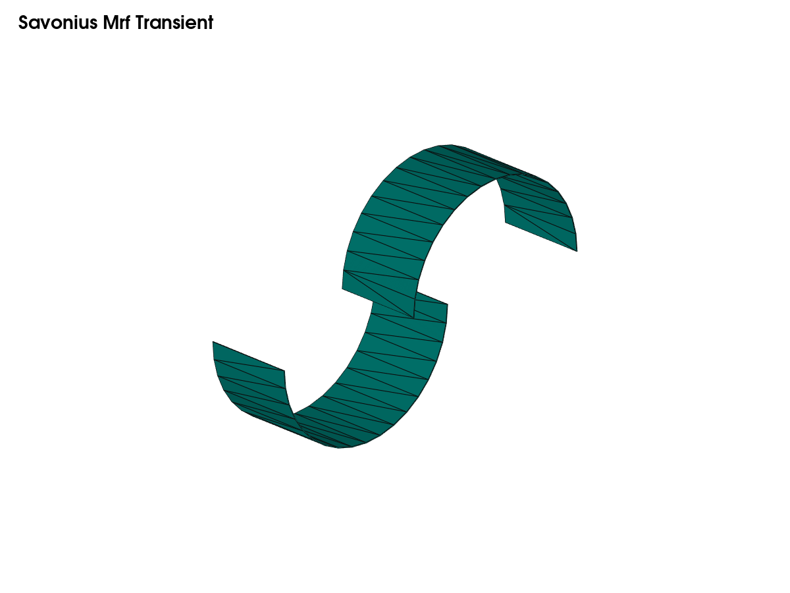
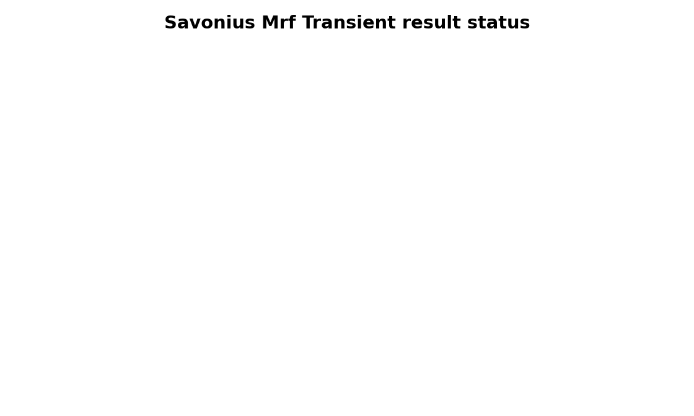

# Savonius Mrf Transient

**Case ID:** `savonius_mrf_transient`  
**Solver:** `pimpleFoam`  
**Status:** `source-ready`

## Purpose

Transient MRF smoke/stability case

## Quick Use

See [USAGE.md](USAGE.md) for exact commands.

## Results

Detailed notes are in [reports/case_report.md](reports/case_report.md).
